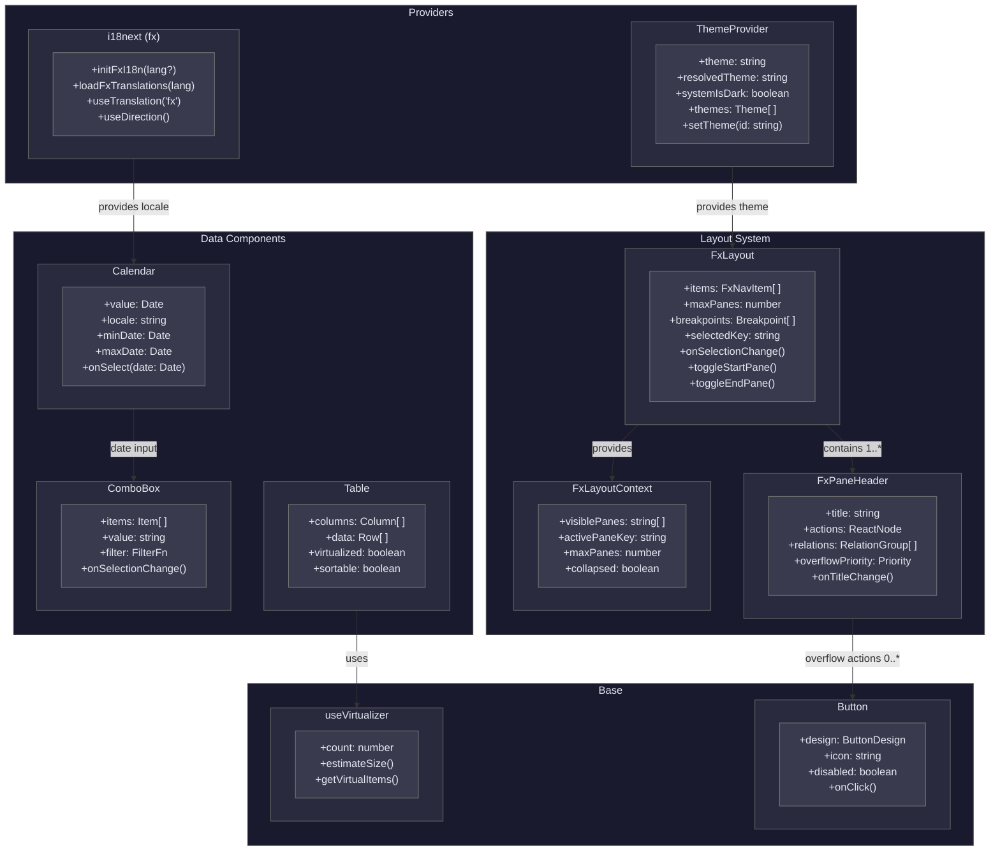
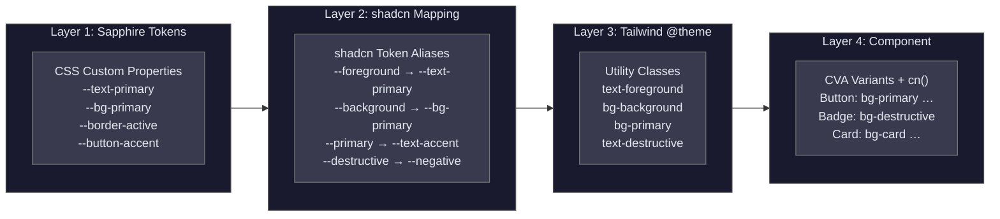
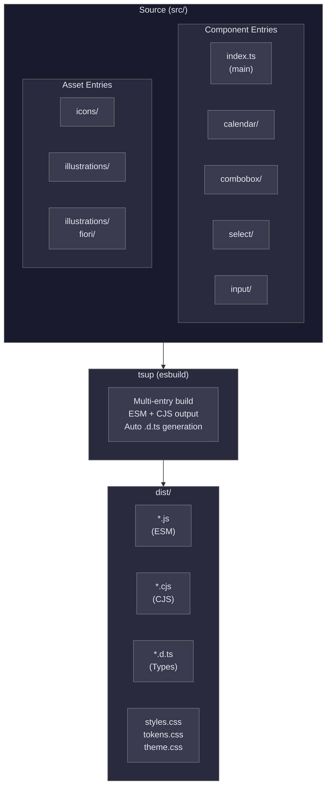
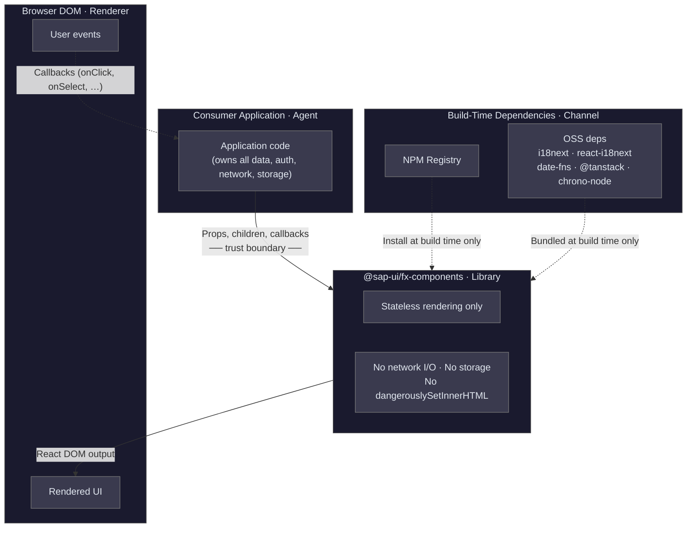
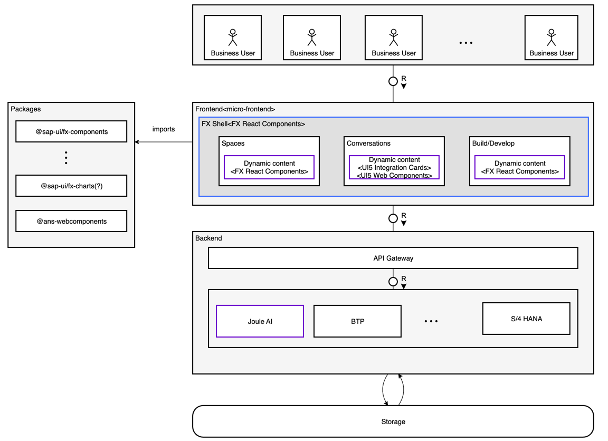

# 3 — Architecture Overview

## 3.1 Introduction

The architecture of `@sap-ui/fx-components` follows a layered, provider-based design that separates concerns into four principal layers: **Components**, **Theme**, **Internationalization**, and **Utilities**. Components consume design tokens from the Theme layer and shared logic from the Utilities layer. `ThemeProvider` establishes theme configuration via React context; i18next provides internationalization via a global singleton initialized with `initFxI18n()`.

The library is built with tsup (esbuild) and outputs dual ESM + CJS bundles with TypeScript declarations. Eight tree-shakeable sub-path exports allow consumers to import only what they need, keeping production bundles small.

This section describes the architecture through five TAM-compliant diagrams and supporting text.

## 3.2 High-Level Block Diagram

The following diagram shows the package boundary of `@sap-ui/fx-components`, its internal layers, and external dependencies.

```mermaid
flowchart TB
    subgraph Package["@sap-ui/fx-components"]
        direction TB

        subgraph ComponentLayer["Component Layer"]
            direction LR
            BasicComponents["Basic\nButton · Badge · Input\nCheckBox · Toggle · Link"]
            CompositeComponents["Composite\nCalendar · DatePicker\nComboBox · Select\nTable · Menu · Dialog"]
            LayoutComponents["Layout\nFxLayout · FxPaneHeader\nBar · Toolbar · Panel\nSideNavigation · Tabs"]
        end

        subgraph ThemeLayer["Theme Layer"]
            direction LR
            ThemeProvider["ThemeProvider\nContext + hook"]
            Tokens["Sapphire Tokens\nCSS custom properties"]
            TailwindTheme["Tailwind @theme\nUtility mapping"]
        end

        subgraph I18nLayer["Internationalization Layer"]
            direction LR
            I18nInit["i18next Init\ninitFxI18n()"]
            LocaleBundles["JSON Locale Bundles\n13 languages · 131 keys"]
            RTLSupport["RTL Support\nAuto layout flip"]
        end

        subgraph UtilityLayer["Utility Layer"]
            direction LR
            Icons["Icons\n500+ components"]
            Illustrations["Illustrations\nSapphire + TNT"]
            Hooks["Shared Hooks\nuseVirtualizer"]
            Utils["Utilities\ncn · date-utils · CVA"]
        end
    end

    subgraph ExternalDeps["External Dependencies"]
        direction LR
        React["React 19\npeer dependency"]
        TailwindCSS["Tailwind CSS 4\noptional peer"]
        I18Next["i18next\npeer dependency"]
        ReactI18Next["react-i18next\npeer dependency"]
        DateFns["date-fns"]
        TanStack["@tanstack/\nreact-virtual"]
        ChronoNode["chrono-node"]
    end

    ComponentLayer --> ThemeLayer
    ComponentLayer --> I18nLayer
    ComponentLayer --> UtilityLayer

    ComponentLayer -.->|peer| React
    TailwindTheme -.->|optional peer| TailwindCSS
    I18nInit -.->|peer| I18Next
    I18nInit -.->|peer| ReactI18Next
    LocaleBundles -.->|i18next resources| I18Next
    Hooks -.->|bundled| TanStack
    Utils -.->|bundled| ChronoNode

    style Package fill:#1a1a2e,stroke:#555,color:#e2e8f0
    style ComponentLayer fill:#2a2a3e,stroke:#666,color:#e2e8f0
    style ThemeLayer fill:#2a2a3e,stroke:#666,color:#e2e8f0
    style I18nLayer fill:#2a2a3e,stroke:#666,color:#e2e8f0
    style UtilityLayer fill:#2a2a3e,stroke:#666,color:#e2e8f0
    style ExternalDeps fill:#2a2a3e,stroke:#666,color:#e2e8f0
    style BasicComponents fill:#3a3a4e,stroke:#777,color:#e2e8f0
    style CompositeComponents fill:#3a3a4e,stroke:#777,color:#e2e8f0
    style LayoutComponents fill:#3a3a4e,stroke:#777,color:#e2e8f0
    style ThemeProvider fill:#3a3a4e,stroke:#777,color:#e2e8f0
    style Tokens fill:#3a3a4e,stroke:#777,color:#e2e8f0
    style TailwindTheme fill:#3a3a4e,stroke:#777,color:#e2e8f0
    style I18nInit fill:#3a3a4e,stroke:#777,color:#e2e8f0
    style LocaleBundles fill:#3a3a4e,stroke:#777,color:#e2e8f0
    style RTLSupport fill:#3a3a4e,stroke:#777,color:#e2e8f0
    style Icons fill:#3a3a4e,stroke:#777,color:#e2e8f0
    style Illustrations fill:#3a3a4e,stroke:#777,color:#e2e8f0
    style Hooks fill:#3a3a4e,stroke:#777,color:#e2e8f0
    style Utils fill:#3a3a4e,stroke:#777,color:#e2e8f0
    style React fill:#3a3a4e,stroke:#777,color:#e2e8f0
    style TailwindCSS fill:#3a3a4e,stroke:#777,color:#e2e8f0
    style DateFns fill:#3a3a4e,stroke:#777,color:#e2e8f0
    style I18Next fill:#3a3a4e,stroke:#777,color:#e2e8f0
    style ReactI18Next fill:#3a3a4e,stroke:#777,color:#e2e8f0
    style TanStack fill:#3a3a4e,stroke:#777,color:#e2e8f0
    style ChronoNode fill:#3a3a4e,stroke:#777,color:#e2e8f0
```



**Key observations:**

- The **Component Layer** is the primary surface area, containing basic, composite, and layout components. All components depend on the Theme and Utility layers but are independent of each other.
- The **Theme Layer** converts Sapphire design tokens (CSS custom properties) through a Tailwind `@theme` mapping into utility classes consumed by components.
- The **I18n Layer** provides UI string translations via i18next (fx namespace with JSON locale bundles) and date formatting via date-fns locale modules.
- External dependencies are kept minimal: React 19 is the only mandatory peer dependency; Tailwind CSS 4 is an optional peer (pre-built CSS is provided as an alternative); i18next and react-i18next are required peer dependencies for components using translated strings.

## 3.3 Component Relationship Diagram

The following diagram shows the key structural relationships within the library, focusing on the FxLayout system, provider pattern, and component composition.



**Key relationships:**

- **ThemeProvider** is a root-level context consumed by all components. **i18next** provides translations via a global singleton (fx namespace) consumed by all components via `useTranslation("fx")`.
- **FxLayout** manages pane visibility and provides **FxLayoutContext** to its children, including **FxPaneHeader** instances.
- **FxPaneHeader** implements a priority-based overflow system that collapses actions into a menu when space is constrained.
- **Table** uses the **useVirtualizer** hook (wrapping @tanstack/react-virtual) for efficient rendering of large data sets.

## 3.4 Theming Layer Diagram

The following diagram shows the four-layer token flow from Sapphire design tokens to component styles.



**Token flow:**

1. **Layer 1 — Sapphire Tokens:** CSS custom properties defined in `tokens.css` provide the ground-truth color values from SAP's Sapphire design language (e.g., `--text-primary: #131625`, `--button-accent: #0040CD`).

2. **Layer 2 — shadcn Mapping:** Standard shadcn/ui token names (`--foreground`, `--background`, `--primary`, `--destructive`) are aliased to the corresponding Sapphire tokens. This allows components written in the shadcn pattern to work without modification.

3. **Layer 3 — Tailwind @theme:** Tailwind CSS 4's `@theme` directive reads the CSS custom properties and generates utility classes (`text-foreground`, `bg-background`, etc.). Sapphire-specific tokens that have no shadcn equivalent are exposed under the `sapphire-*` namespace (e.g., `bg-sapphire-bg-tertiary`).

4. **Layer 4 — Component:** Components use CVA (Class Variance Authority) to define variant classes and the `cn()` utility to merge conditional class names. The resulting class strings reference only Tailwind utility classes, never raw color values.

**Theme switching** is handled by `ThemeProvider`, which applies a `theme-{id}` class to the `<html>` element. Each theme overrides the Layer 1 CSS custom properties, and the cascade automatically updates all downstream layers.

### Token Categories and Scope

The theming system defines **90+ CSS custom properties** organized into 10 categories:

| Category | Examples | Count |
|---|---|---|
| Core / shadcn | `--foreground`, `--background`, `--primary`, `--destructive` | ~19 |
| Text | `--text-primary`, `--text-secondary`, `--text-tertiary`, `--text-disabled` | ~6 |
| Surfaces | `--bg-primary`, `--bg-secondary`, `--bg-tertiary`, `--bg-canvas` | ~6 |
| Borders | `--border`, `--border-active`, `--border-accent` | ~4 |
| Chrome | `--chrome-bg`, `--chrome-fg`, `--chrome-active`, `--chrome-hover` | ~6 |
| Buttons | `--button-accent`, `--button-accent2`, `--button-on-accent` | ~8 |
| Icons | `--icon-accent`, `--icon-muted`, `--icon-on-accent` | ~5 |
| Notifications | `--notification-positive`, `--notification-warning`, `--notification-info` | ~12 |
| Brand palette | `--neutral-*`, `--blue-*`, `--purple-*`, `--green-*` | ~20+ |
| Spacing scale | `--spacing-3xs` (4px) through `--spacing-4xl` (64px) | ~10 |

### Shipped Themes

Light and dark Sapphire themes ship with the library as built-in defaults. The demo application demonstrates **19 themes total** (9 standard + 10 creative, including Fiori, cyberpunk, ocean, sunset, and more) as proof of the system's extensibility. Since themes are pure CSS variable overrides, any shadcn community theme also works as a drop-in replacement.

### Custom Theme Creation

Consumers create custom themes by defining the ~19 core shadcn CSS variables in a `.theme-{id}` class and registering the theme with `ThemeProvider`. All components adapt automatically with zero Tailwind configuration or component changes:

```css
.theme-custom {
  --background: #1a1a2e;
  --foreground: #e0e0e0;
  --primary: #0f3460;
  /* ... remaining ~16 core variables ... */
}
```

No JavaScript, no Tailwind config modifications, and no component-level overrides are required — the CSS cascade handles propagation through all four layers.

### Sapphire Extension Fallback System

Sapphire-specific tokens (`sapphire-*` namespace) — covering text-tertiary, button-accent, chrome-bg, icon-muted, and similar extensions beyond the shadcn standard — **auto-derive from the core shadcn tokens** when not explicitly defined. This means a minimal custom theme that defines only the ~19 core variables still gets sensible values for all 90+ tokens. Consumers can optionally override individual sapphire-* tokens for fine-grained control.

### Spacing Tokens

A named spacing scale provides consistent layout rhythm:

| Token | Value | Tailwind Class |
|---|---|---|
| `--spacing-3xs` | 4px | `p-sapphire-3xs` |
| `--spacing-2xs` | 8px | `p-sapphire-2xs` |
| `--spacing-xs` | 12px | `p-sapphire-xs` |
| `--spacing-s` | 16px | `p-sapphire-s` |
| `--spacing-m` | 20px | `p-sapphire-m` |
| `--spacing-l` | 24px | `p-sapphire-l` |
| `--spacing-xl` | 32px | `p-sapphire-xl` |
| `--spacing-2xl` | 40px | `p-sapphire-2xl` |
| `--spacing-3xl` | 48px | `p-sapphire-3xl` |
| `--spacing-4xl` | 64px | `p-sapphire-4xl` |

Spacing tokens are available as both CSS variables (for inline styles) and Tailwind utility classes (for class-based usage).

## 3.5 Build Architecture

The library uses a multi-entry build architecture to enable tree-shakeable imports:



**Entry points and package exports:**

| Import Path | Source Entry | Contents |
|---|---|---|
| `@sap-ui/fx-components` | `src/index.ts` | All 38+ components, providers, utilities |
| `@sap-ui/fx-components/calendar` | `src/components/calendar/index.ts` | Calendar, DatePicker, DateTimePicker |
| `@sap-ui/fx-components/combobox` | `src/components/combobox/index.ts` | ComboBox |
| `@sap-ui/fx-components/select` | `src/components/select/index.ts` | Select |
| `@sap-ui/fx-components/input` | `src/components/input/index.ts` | Input |
| `@sap-ui/fx-components/icons` | `src/icons/index.ts` | 500+ icon components |
| `@sap-ui/fx-components/illustrations` | `src/illustrations/index.ts` | All illustration sets |
| `@sap-ui/fx-components/illustrations/fiori` | `src/illustrations/fiori/index.ts` | Fiori illustration set |

**CSS outputs** are separate from the JavaScript bundle:
- `styles.css` — Tailwind-compiled utility classes (minified)
- `tokens.css` — Sapphire design token definitions (CSS custom properties)
- `theme.css` — Theme class definitions (`theme-light`, `theme-dark`, etc.)

## 3.6 Component Organization Pattern

Each component follows a consistent file structure:

```
src/components/[component-name]/
├── [ComponentName].tsx       # Component implementation (CVA variants, forwardRef)
├── [SubComponent].tsx        # Sub-components if applicable
└── index.ts                  # Barrel export

src/types/[component-name].ts  # TypeScript type definitions (props, enums, events)
src/hooks/use[Feature].ts      # Shared hooks extracted from components
```

**Key patterns:**

- **Types are separated** from component files into `src/types/` to enable importing types without pulling in component code.
- **CVA (Class Variance Authority)** defines visual variants (design, size, state) as a typed mapping from prop values to Tailwind classes.
- **`cn()` utility** merges Tailwind class lists with conflict resolution via `tailwind-merge`, combined with `clsx` for conditional logic.
- **`forwardRef`** is used on all components to allow parent ref access.
- **Controlled and uncontrolled** patterns are supported via internal state that yields to props when provided.

## 3.7 Provider and Initialization Pattern

The library uses a context provider for theming and a singleton initialization for internationalization:

```tsx
import { ThemeProvider, initFxI18n } from '@sap-ui/fx-components';

// Initialize i18n before React renders (once, at app startup)
await initFxI18n("en");

function App() {
  return (
    <ThemeProvider defaultTheme="light">
      {/* Application content — no I18nProvider wrapper needed */}
    </ThemeProvider>
  );
}
```

For shell integration (Engagement Layer), the app provides translations via the AppAPI contract:

```tsx
import { loadFxTranslations } from '@sap-ui/fx-components';

// In AppAPI implementation:
async loadTranslations(lang) { return loadFxTranslations(lang); }
getAppConfig() { return { i18nNamespace: "fx", ... }; }
```

- **ThemeProvider** manages the active theme, detects system color scheme preference, applies theme classes to `<html>`, and exposes `useTheme()` for reading and changing the theme.
- **i18next (fx namespace)** — `initFxI18n()` initializes the i18next singleton with the fx namespace, registering all 13 locale bundles (131 translation keys each). Components access translations via `useTranslation("fx")` from react-i18next. Runtime language switching is handled via `i18n.changeLanguage()` plus `loadFxTranslations()`. `useDirection()` provides RTL detection. When running inside the Engagement Layer shell, the shell owns the i18next instance and the app provides translations via the `AppAPI.loadTranslations()` contract using `loadFxTranslations()`.

ThemeProvider is optional — components fall back to the light theme when no provider is present. i18next initialization via `initFxI18n()` is required before components render; in shell environments, the shell handles initialization.

## 3.8 Security Context Diagram

The following diagram maps the library to the **Agents / Channels / Storages** model used in SAP threat-modeling workshops (PSS / TAM methodology). Because `@sap-ui/fx-components` is a stateless, client-side rendering layer, the diagram is intentionally simple: there is no data storage, no network communication, and no backend.



### Threat-model properties

1. **Agents** — Only two entities interact with the library at runtime: the **consuming application** (passes props, receives callbacks) and the **end-user browser** (renders DOM, dispatches events). The library itself initiates no actions.

2. **Channels** — The library has **no runtime network channels**. It makes no HTTP, WebSocket, or fetch calls. All data enters through React props and exits as DOM output plus callback invocations. The only external channel is the **NPM registry**, used exclusively at build time.

3. **Storages** — The library performs **no data persistence**. It does not read or write to localStorage, sessionStorage, IndexedDB, cookies, or any server-side store. All components are pure, stateless renderers (React state is transient UI state such as "menu open", not user data).

4. **Trust boundary** — The boundary sits at the **component prop interface**. The library trusts that the consumer provides well-formed props. React's JSX escaping provides built-in XSS protection for any untrusted string content rendered through props. The library never uses `dangerouslySetInnerHTML`.

5. **Dependencies** — All open-source dependencies (`i18next`, `react-i18next`, `date-fns`, `@tanstack/react-virtual`, `chrono-node`) are installed from NPM and bundled at build time (i18next and react-i18next are externalized as peer dependencies). There is no CDN loading, dynamic `import()` of remote modules, or runtime script injection.

6. **No PII processing** — The library renders whatever UI content the consumer passes via props. It does not inspect, log, transform, or transmit personal data. Any PII handling is solely the responsibility of the consuming application.

## 3.9 Engagement Layer — Application Consumption Diagram

The following diagram shows how applications consume (high-level) the `@sap-ui/fx-components` package family as part of the **Engagement Layer**. The frontend application has two areas — a **static shell** (layout, navigation, chrome) and a **dynamic content** area driven by AI responses. Both import from the same package family. A backend application layer behind an API gateway provides access to Joule AI, SAP BTP services, and S/4HANA, with persistent storage underneath.



**Layers:**

1. **End Users** — Multiple users access the frontend application via a web browser over HTTPS.

2. **Packages** — The `@sap-ui/fx-components` library (and future sibling packages such as `@sap-ui/fx-charts`, `@sap-ui/fx-notifications`) are imported by the application at build time. They provide all UI building blocks.

3. **Application (Frontend)** — Two areas consume the library:
    - **Static Shell** (blue) — Persistent layout chrome rendered from `FxLayout`, `FxSideNavigation`, `FxPaneHeader`, `FxUserMenu`, wrapped in `ThemeProvider` with i18next initialized via `initFxI18n()`.
    - **Dynamic Content** (purple) — AI-driven area where `FxPromptInput` captures user intent, and a JSON renderer maps Joule's structured response to library components (`Table`, `Card`, `List`, `Dialog`, etc.).

4. **Application (Backend)** — An **API Gateway** routes requests to backend services:
    - **Joule AI** (purple) — Processes natural-language intents and returns structured JSON for the dynamic content renderer.
    - **BTP** — SAP Business Technology Platform services.
    - **S/4HANA** — Line-of-business data and transactions.

5. **Storage** — Persistent data layer (SAP HANA, databases) consumed by the backend services.

**Key points:**

- The library packages are **stateless UI building blocks** — all orchestration lives in the application.
- **Static shell and dynamic content share the same component set** — visual consistency is guaranteed.
- The frontend **never talks to backend services directly** — all communication goes through the API Gateway via REST.
- Packages marked with **(?)** are planned separate ones as additions to the `@sap-ui/fx-*` family.
